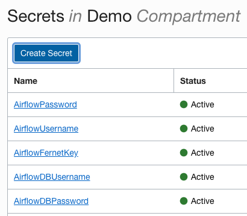

# OCI-Airflow
[Apache Airflow](https://airflow.apache.org/) on Oracle Cloud Infrastructure

This Quick Start uses [OCI Resource Manager](https://docs.cloud.oracle.com/iaas/Content/ResourceManager/Concepts/resourcemanager.htm) to make deployment quite easy.  Simply [download the latest .zip](https://github.com/oracle-quickstart/oci-airflow/archive/master.zip) and follow the [Resource Manager instructions](https://docs.cloud.oracle.com/en-us/iaas/Content/ResourceManager/Tasks/managingstacksandjobs.htm) for how to build a stack.

It is highly suggested you use the included schema file to make deployment even easier.   In order to leverage this feature, the GitHub zip must be repackaged so that it's contents are top-level prior to creating the ORM Stack.  This is a straight forward process:

                unzip oci-airflow-master.zip
                cd oci-airflow-master
                zip -r oci-airflow.zip *

Use the `oci-airflow.zip` file created in the last step to create the ORM Stack.  The schema file can even be customized for your use, enabling you to build a set of approved variables for deployment.

This template will build VCN/Subnets as part of deployment, but also has options for using pre-existing VCN/Subnets.  If using pre-existing network topology, ensure you have a security list entry allowing port TCP 8080 ingress/egress for access to the Airflow UI.   Also ensure a gateway is present to allow Internet access for the Airflow host, as Airflow is downloaded and compiled as part of deployment using options selected in the Resource Manager schema.

## Deployment customization

The schema file offers an advanced deployment options.   When enabled you can select which airflow libraries are installed during deployment, choose which executor you want to use, and customize other deployment parameters for metadata database, security, and high availability.   Defaults are for SSH, Oracle, and MySQL. Note that the apache-airflow[mysql] package is required for installation.   If disabled this will result in a deployment failure.

## Metadata Database

### mysql-local
This template uses a community edition of MySQL for Airflow metadata.   This is downloaded and installed during provisioning.   The default root database password is set in the [master_boot.sh](https://github.com/oracle-quickstart/oci-airflow/blob/master/scripts/master_boot.sh#L256) which is run in CloudInit.  It's highly suggested you change the password either prior to deployment, or afterwards to something more secure.

### mysql-oci
This deploys a MySQL DB instance on OCI and uses it for metadata in Airflow.  You will need to set some Secret Vault values prior to deployment for this to work, see the Security section below.
*In Development*

### oracle
*In Development* - This requires some updates to Alembic to work properly.

## Celery for parallelized execution

This template also supports celery executor to parallelize execution among multiple workers.  If using celery and pre-existing VCN/Subnet, ensure a security list entry is present allowing TCP 5555 ingress/egress for the Flower UI on the Airflow master.

See the Security section below for detail on synchronization of Fernet Key among cluster hosts.

### FSS
OCI Filesystem Service is offered when using celery.   Enabling this will create an NFS mount on each host in the cluster for `/opt/airflow/dags`.  This provides a single location to manage DAGs in the cluster, and ensures any changes will be in sync among all cluster hosts.

## OCI Hooks, Operators, Sensors

This template automatically downloads and installs hooks, operators, and sensors for OCI services into `/opt/airflow/plugins`.   These plugins are fetched remotely by the airflow master instance from this github repository using `wget` as part of the CloudInit deployment.   Long term these hooks, operators and sensors will be committed upstream to Apache Airflow and be included as part of the native deployment.

## Security
[Instance Principals](https://docs.cloud.oracle.com/en-us/iaas/Content/Identity/Tasks/callingservicesfrominstances.htm) needs to be enabled for all functionality below.  This is offered as part of deployment, but you may need to have your tenancy administrator enable policies for you if you don't have privileges to the tenancy root.

This template offers basic [Airflow security](https://airflow.apache.org/docs/stable/security.html) when deploying using ORM.   Click Advanced Options > Enable Security to enable local password auth for the Airflow UI.   The password for this needs to be setup in OCI Secrets Vault prior to deployment.

See [Overview of Vault](https://docs.cloud.oracle.com/en-us/iaas/Content/KeyManagement/Concepts/keyoverview.htm) for more information on how to setup and configure a Vault.   

The Secrets Vault should be in the same compartment where you are deploying Airflow, and should use the following syntax:

 

* AirflowPassword - Password for the Airflow Web UI
* AirflowUsername - Username for the Airflow Web UI
* AirflowFernetKey - [Generate a Fernet Key](https://bcb.github.io/airflow/fernet-key) which is synchronized for celery deployments.
* AirflowDBUsername - Username for the Metadata Database (not used in mysql-local)
* AirflowDBPassword - Password for the Metadata Database (not useed in mysql-local)

## Logging

Deployment activities are logged to `/var/log/OCI-airflow-initialize.log`

This should provide some detail on installation process.  Note that the Airflow UI is not immediately available after Terraform deployment, as the binaries are compiled as part of deployment.   Watching the log file will tell you when the deployment is complete and the Airflow UI is available.

## SystemD 

There are daemon scripts setup as part of deployment.  Airflow can be controlled using systemd commands:

	systemctl (start|stop|status|restart) airflow-webserver
	systemctl (start|stop|status|restart) airflow-scheduler

Also if using celery, the flower service is present on the airflow master, as well as an airflow-worker service on worker nodes.

	systemctl (start|stop|status|restart) flower
	systemctl (start|stop|status|restart) airflow-worker

All services are started during deployment and set to start at boot using chkconfig.
